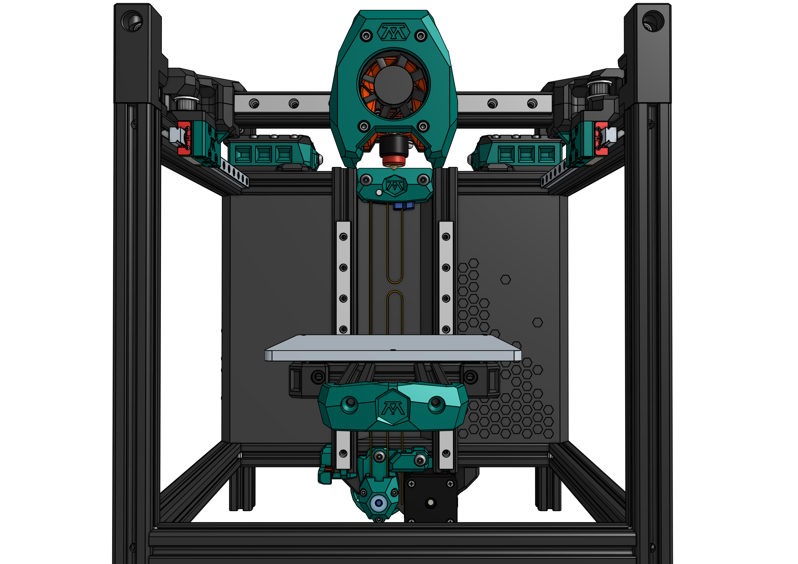

# This is a fork of GSL12's Tiny-M V5 Beta

As GSL12 currently is not able to continue work on V5, I'm trying to continue
and add my own mods along the way. As I'm doing this in my spare time, don't
expect frequent updates and additions.

### IMPORTANT:
The files are still in BETA. I have not yet built the Tiny-M
with the beta files. If you choose to use them, you do it at your own
risk. I will not provide any support!

I have not checked the BOM's either. It is possible that parts are missing.

