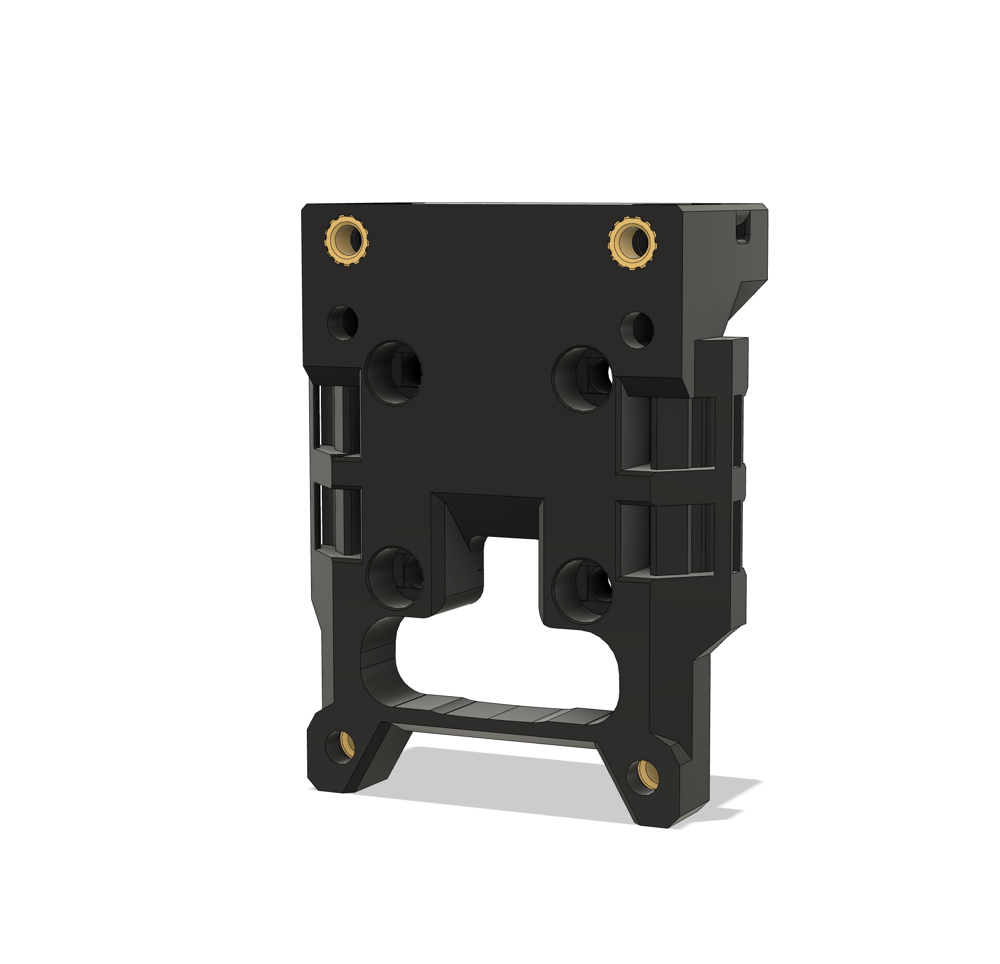
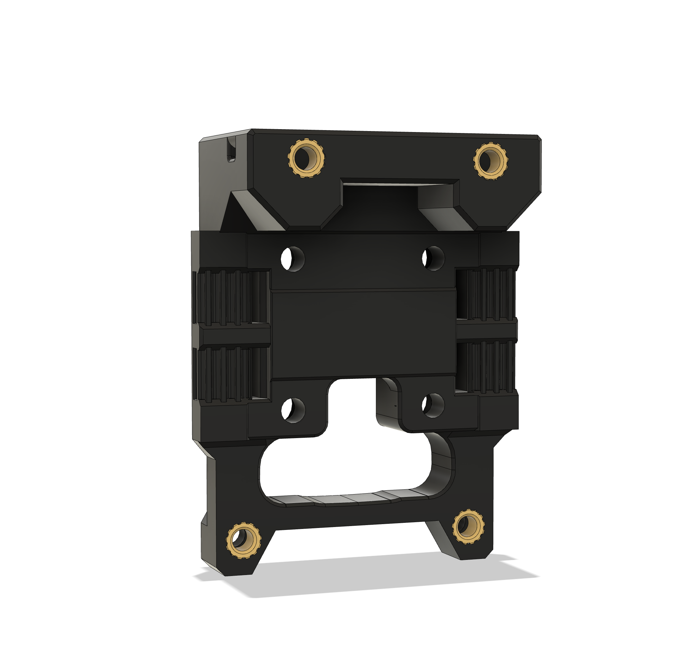

# All files are still in beta

The revo mount is an unaltered copy from the original repository.

### Dragon Hotend Mount
The dragon mount is a new, untested design! As you can see: it fits with the shroud and fan attached but it has not been installed on the printer yet. Feel free to test it and give some feedback.

### X-carriage Update
The x-carriage was updated as the STL in the original repository was outdated. 2 more heat set inserts were added to be able to screw in the X-endstop mount. The endstop mount was missing in the original repo, so I've added it to the X-carriage STLs.

Heatset insert locations:

